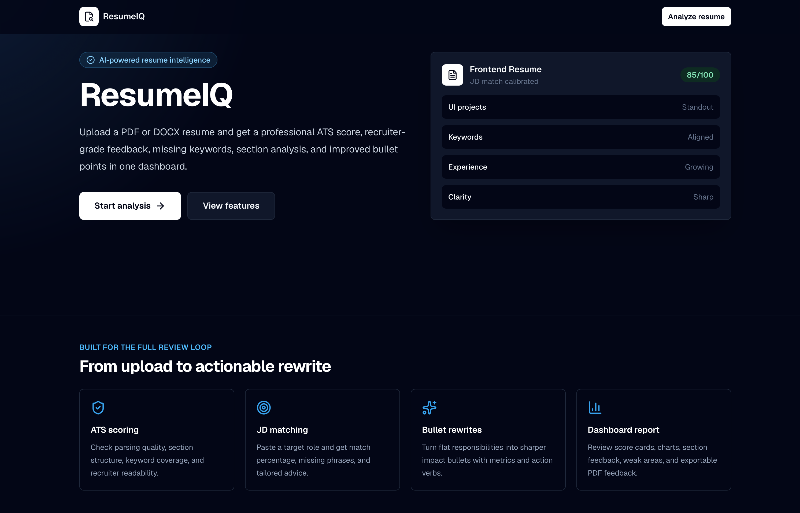
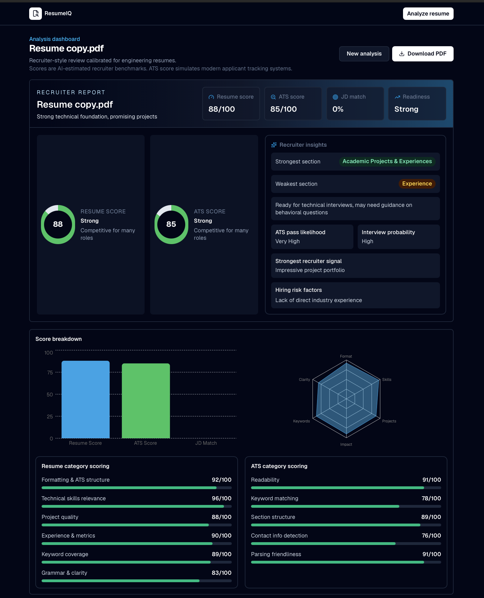
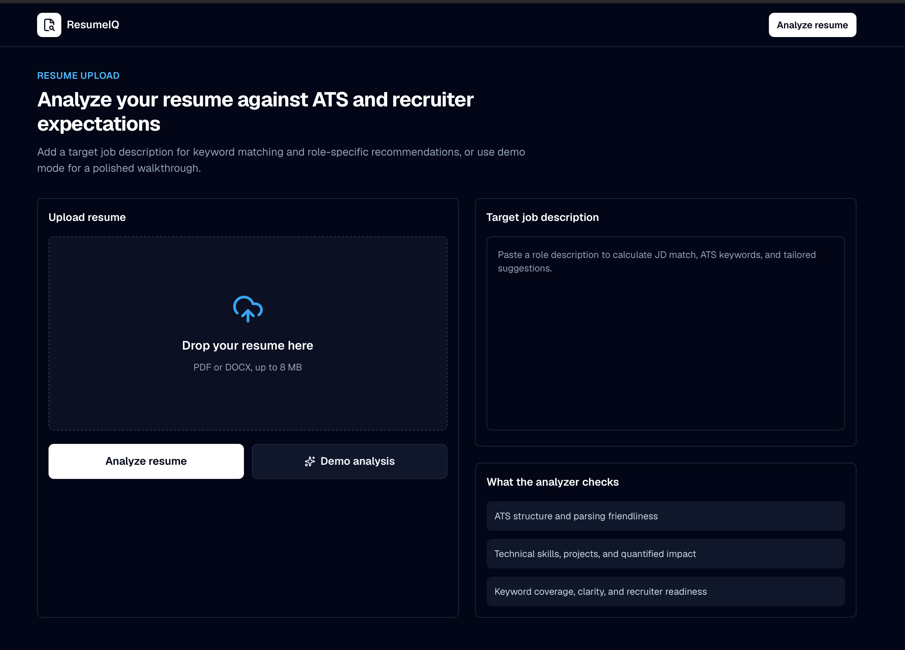
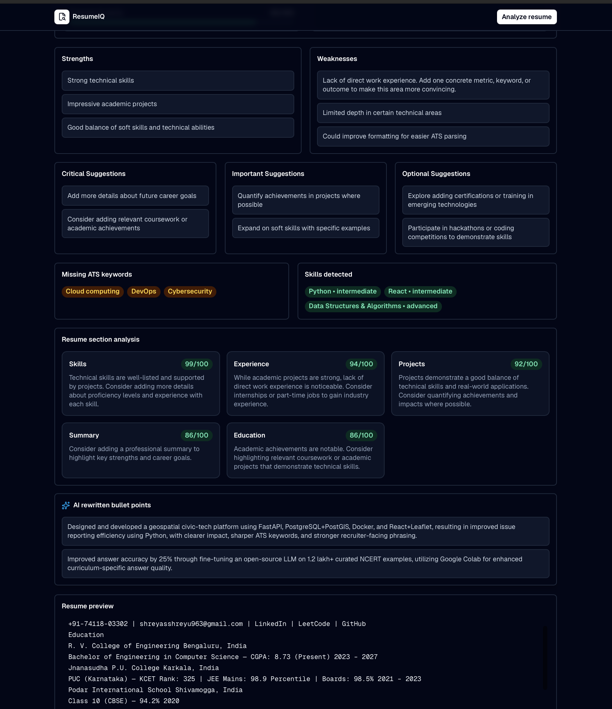

# ResumeIQ AI Resume Analyzer

AI-powered resume analysis platform that scores resumes against job descriptions and turns LLM feedback into recruiter-ready insights.


> Built with Next.js App Router, Groq LLM (Llama 3.3 70B), Zod schema validation, and Recharts. Features ATS scoring, keyword gap analysis, JD match percentage, multi-persona LLM feedback, and exportable PDF reports.

**Live Demo:** [resumeiq-ai-resume-analyzer.vercel.app](https://resumeiq-ai-resume-analyzer.vercel.app)

## Overview

ResumeIQ helps candidates and reviewers evaluate how well a resume matches a target role. Users upload a PDF or DOCX resume, optionally add a job description, and receive structured AI feedback covering ATS readiness, keyword alignment, job-description match, strengths, gaps, grammar issues, and actionable improvement suggestions.

The project is designed as a polished portfolio-grade product: a modern Next.js frontend, a typed API boundary, server-side document parsing, schema-validated LLM output, visual scoring, and exportable analysis reports.

## Screenshots






## Features

- Drag-and-drop PDF or DOCX resume upload.
- Server-side text extraction with `pdfjs-dist` and `mammoth`.
- Resume score, ATS score, and job-description match percentage.
- Keyword gap analysis to identify missing role-critical terms.
- Multi-persona AI feedback from ATS, recruiter, and career-coach perspectives.
- Grammar feedback, skills extraction, section-level feedback, and rewritten bullet suggestions.
- Structured response validation with Zod for predictable UI rendering.
- Visual dashboard with Recharts and responsive Tailwind CSS styling.
- Downloadable PDF reports for saving or sharing analysis results.
- Secure server-side Groq API usage through `GROQ_API_KEY`.

## Tech Stack

| Area | Technology | Purpose |
| --- | --- | --- |
| Framework | Next.js App Router | Full-stack React application and API routes |
| Language | TypeScript | Type-safe application logic and interfaces |
| Styling | Tailwind CSS | Responsive UI and utility-first styling |
| AI Provider | Groq | Fast LLM inference through an OpenAI-compatible API |
| Model | Llama 3.3 70B Versatile | Resume and job-description analysis |
| Validation | Zod | Schema validation for AI responses |
| Parsing | `pdfjs-dist`, `mammoth` | PDF and DOCX resume text extraction |
| Charts | Recharts | Score and dashboard visualizations |
| Reports | jsPDF, html2canvas | Exportable PDF report generation |
| Deployment | Vercel | Production hosting and serverless runtime |

## Architecture

ResumeIQ follows a focused full-stack architecture:

1. The user uploads a resume and optionally provides a target job description through the Next.js UI.
2. The frontend sends multipart form data to the `/api/analyze` route.
3. The API route validates the uploaded file, extracts resume text, and builds a structured prompt.
4. Groq runs the prompt against `llama-3.3-70b-versatile` using the OpenAI-compatible API format.
5. The response parser strips accidental markdown fences, extracts the JSON payload, and validates the result with Zod.
6. The UI renders resume scores, ATS feedback, keyword gaps, skill summaries, section feedback, rewritten bullets, charts, and downloadable report content.

Development-only AI agent context files are stored in `.codex/`. `CLAUDE.md` and `AGENTS.md` were used during development to provide coding-agent instructions and project context; they are not part of the runtime application.

## Folder Structure

```text
.
├── .codex/
│   ├── AGENTS.md
│   └── CLAUDE.md
├── screenshots/
│   └── .gitkeep
├── src/
│   ├── app/
│   │   ├── api/analyze/route.ts
│   │   ├── dashboard/page.tsx
│   │   ├── upload/page.tsx
│   │   ├── page.tsx
│   │   ├── layout.tsx
│   │   └── globals.css
│   ├── components/
│   │   ├── dashboard/
│   │   ├── ui/
│   │   ├── site-header.tsx
│   │   └── upload-form.tsx
│   ├── lib/
│   │   ├── groq.ts
│   │   ├── pdf-parser.ts
│   │   ├── prompts.ts
│   │   ├── resume-parser.ts
│   │   └── validation.ts
│   ├── types/
│   │   └── resume.ts
│   └── utils/
│       └── cn.ts
├── .env.example
├── README.md
├── package.json
└── next.config.ts
```

## Getting Started

### Prerequisites

- Node.js 18 or newer.
- npm, pnpm, yarn, or bun.
- A Groq API key from the [Groq Console](https://console.groq.com/keys).

### Installation

Clone the repository, install dependencies, and run the local development server:

```bash
git clone <repository-url>
cd AI_resume_analyzer
npm install
npm run dev
```

Open [http://localhost:3000](http://localhost:3000) to view the application.

### Environment Setup

Create a local environment file from the example:

```bash
cp .env.example .env.local
```

Then add your Groq API key:

```env
GROQ_API_KEY=your_groq_api_key_here
```

The Groq API key is used only by the server-side API route and is never exposed to the browser.

## How it works

ResumeIQ compares resume content against an optional job description using a structured LLM workflow. The analysis prompt asks the model to evaluate ATS compatibility, role alignment, missing keywords, resume strengths, weaknesses, grammar issues, skills, section quality, and bullet rewrites.

The model is instructed to respond as an ATS system, recruiter, and career coach while returning JSON that matches the app's validation schema. The API route cleans the response, validates it with Zod, and returns a dashboard-ready payload to the frontend.

This approach keeps the product useful for evaluation scenarios: reviewers can quickly understand the system design, candidates can act on the feedback, and technical reviewers can see how the AI response is constrained before entering the UI.

## API Reference

### `POST /api/analyze`

Analyzes an uploaded resume against an optional job description and returns structured scoring and feedback.

**Request format**

`multipart/form-data`

| Field | Type | Required | Description |
| --- | --- | --- | --- |
| `resume` | File | Yes | PDF or DOCX resume file |
| `jobDescription` | String | No | Target job description used for match scoring and keyword analysis |

**Response**

```json
{
  "resumeScore": 85,
  "atsScore": 78,
  "jdMatchPercentage": 72,
  "strengths": [],
  "weaknesses": [],
  "missingKeywords": [],
  "skills": [],
  "grammarIssues": [],
  "suggestions": {
    "critical": [],
    "important": [],
    "optional": []
  },
  "rewrittenBullets": [],
  "sectionFeedback": {}
}
```

The endpoint validates the uploaded file, extracts resume text, calls Groq server-side, validates the AI response, and returns useful API errors if parsing or validation fails.

## Deployment to Vercel

ResumeIQ is ready for Vercel deployment:

1. Push the project to GitHub.
2. Import the repository into Vercel.
3. Add `GROQ_API_KEY` in the Vercel project environment variables.
4. Deploy the project.

The live production build is available at [resumeiq-ai-resume-analyzer.vercel.app](https://resumeiq-ai-resume-analyzer.vercel.app).

## Future Enhancements

- Authentication with Clerk or Auth.js.
- Database storage for previous analyses.
- AI-generated cover letters.
- Resume tailoring for a specific job.
- Multi-resume comparison.
- Side-by-side resume and job-description comparison.
- Shareable report links.

## Author

Built by Shreyas R. as a portfolio project demonstrating full-stack AI product development with Next.js, TypeScript, Groq, document parsing, structured validation, and production deployment on Vercel.
